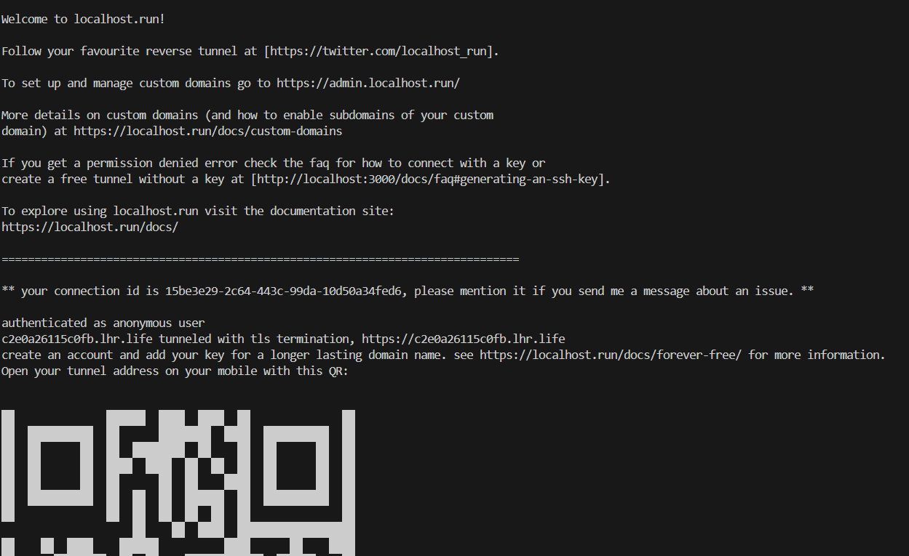

## Pre-Req to install docker and kind
``` bash
sudo apt install docker.io
sudo snap install kubectl --classic
curl -Lo ./kind https://github.com/kubernetes-sigs/kind/releases/download/v0.20.0/kind-linux-amd64 # Replace v0.20.0 with the latest release version if desired
chmod +x ./kind
sudo mv ./kind /usr/local/bin/kind
```

## Commands to interact docker
``` bash
cd docker/
docker build -t shadabshah1680/master-project:http-server .
docker run -it  -p 80:80 shadabshah1680/master-project:http-server
docker push shadabshah1680/master-project:http-server
```

## Commands to interact with kind
``` bash
kubectl apply -f .
kubectl port-forward -n http-server svc/http-server-service 8080:83
ssh -R 80:localhost:8080 ssh.localhost.run

```
Please look for link  https://c2e0a26115c0fb.lhr.life